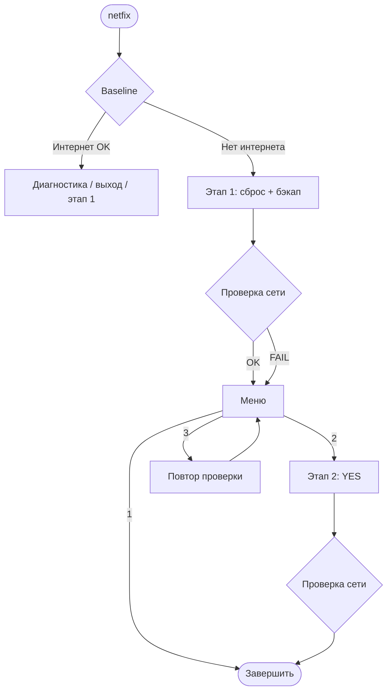

<div align="center">

# netfix

**Восстановление сети в Linux одной командой**

Пошаговый сброс с бэкапом, проверкой интернета и опциональной глубокой очисткой.

<br>

[](https://www.kernel.org/)
[](https://www.gnu.org/software/bash/)
[](LICENSE)
[](https://networkmanager.dev/)

<br>

<a href="docs/netfix-demo.gif">
  
</a>

*Клик — открыть GIF в полном размере*

<br>

</div>

---

## О проекте

Когда «интернет пропал» или сеть ведёт себя странно — не открываются сайты, пропал Wi‑Fi, «залипли» `iptables`, маршруты или виртуальные интерфейсы — **`netfix`** проводит вас через безопасный сценарий восстановления.

| | |
|---|---|
| **Подход** | Сначала диагностика и умеренный сброс, при необходимости — глубокая очистка |
| **Безопасность** | Бэкап до изменений, подтверждения, команды отката в выводе |
| **Проверки** | ping, DNS, [neverssl](http://neverssl.com/) (тело ответа), HTTPS, IPv6 |

> [!NOTE]
> Требуются права **root**. Запуск: `netfix` (alias → `sudo /usr/local/bin/netfix`).

<details>
<summary><strong>Содержание</strong></summary>

<br>

- [Быстрый старт](#быстрый-старт)
- [Демо](#демо)
- [Возможности](#возможности)
- [Как это работает](#как-это-работает)
- [Два этапа](#два-этапа-что-делает-каждый)
  - [Этап 1 — жёсткий сброс](#этап-1--жёсткий-сброс-основной-обычно-достаточно)
  - [Этап 2 — ядерная очистка](#этап-2--ядерная-очистка-опционально-вручную)
- [Установка](#установка)
- [Использование](#использование)
- [Бэкапы и откат](#бэкапы-и-откат)
- [Логи](#логи-как-смотреть)
- [Ограничения](#ограничения)
- [Структура репозитория](#структура-репозитория)
- [Обновление и удаление](#обновление)
- [Совместимость](#совместимость)
- [FAQ](#faq)
- [Шпаргалка](#шпаргалка)
- [Участие в проекте](#участие-в-проекте)

</details>

---

## Быстрый старт

```bash
git clone https://github.com/Ermakov764/netfix-linux.git
cd netfix-linux
chmod +x install.sh
sudo ./install.sh
source ~/.bashrc
netfix
```

---

## Возможности

| Ситуация | Решение |
| -------- | ------- |
| Сайты не грузятся при «живом» Wi‑Fi | Сброс iptables, DNS-кэша, перезапуск NetworkManager |
| После Docker, K8s, VPN, виртуалок | Удаление залипших мостов и лишних правил |
| Непонятно, есть ли интернет | 7 проверок, 3 повтора; captive portal через neverssl |
| Страшно сломать систему | Бэкап + baseline «интернет уже есть — выйти?» |

netfix **не заменяет** ремонт кабеля, адаптера или линии провайдера — но закрывает типичные программные сбои на стороне ОС.

---

## Как это работает



---

## Два этапа: что делает каждый

### Этап 1 — жёсткий сброс (основной, обычно достаточно)

| | |
|---|---|
| **Зачем** | Убрать «застрявшее» состояние без уничтожения всех соединений |
| **Действия** | Бэкап → остановка Docker/K8s (при наличии) → iptables → мосты → NetworkManager → DNS |
| **Проверка** | ping, DNS, neverssl, HTTPS, IPv6 (с повторами) |
| **Откат** | Команда `iptables-restore` в конце отчёта |

### Этап 2 — ядерная очистка (опционально, вручную)

| | |
|---|---|
| **Зачем** | Если этап 1 не помог — сброс conntrack, veth, ARP, netns |
| **Запуск** | Только из меню после этапа 1, ввод **`YES`** |
| **Риск** | Разрыв SSH и VPN — нужна консоль хостинга |

> [!WARNING]
> **Этап 2** обрывает активные сессии. На удалённом сервере используйте VNC/IPMI. Если интернет уже работает после этапа 1 — ядерный сброс обычно **не нужен**.

---

## Установка

### Автоматически (рекомендуется)

```bash
git clone https://github.com/Ermakov764/netfix-linux.git
cd netfix-linux
chmod +x install.sh
sudo ./install.sh
source ~/.bashrc   # один раз в текущем терминале
```

`install.sh`:

1. Копирует скрипт в `/usr/local/bin/netfix`
2. Добавляет alias в `~/.bashrc` и `~/.zshrc` (пользователь, вызвавший `sudo`)

В новом терминале: **`netfix`**. Без alias: `sudo /usr/local/bin/netfix`.

### Вручную

```bash
cd netfix-linux
sudo cp netfix.sh /usr/local/bin/netfix
sudo chmod 755 /usr/local/bin/netfix
echo 'alias netfix="sudo /usr/local/bin/netfix"' >> ~/.bashrc
source ~/.bashrc
```

### Требования

| Компонент | Назначение |
| --------- | ---------- |
| Linux + bash | Основной runtime |
| `sudo` / root | Все операции с сетью |
| NetworkManager | Перезапуск сети (`systemctl`) |
| `curl` | HTTP/HTTPS проверки (желательно) |
| `ping`, `getent` | Базовые проверки |

---

## Использование

```bash
netfix
```

| Шаг | Описание |
| --- | -------- |
| 1 | **Baseline** — если интернет есть: диагностика / сброс / выход |
| 2 | **Этап 1** — сброс и проверка |
| 3 | **Меню** — `[1]` выход · `[2]` этап 2 · `[3]` повторить проверку |
| 4 | **Этап 2** — только по вашему выбору |

---

## Бэкапы и откат

### Когда создаётся бэкап

| Момент | Бэкап? |
| ------ | ------ |
| Только диагностика (baseline) | Нет |
| Перед этапом 1 (после `y`) | **Да**, один раз за запуск |
| Перед этапом 2 | Нет нового — тот же каталог |

Снимок — состояние **до первого сброса** в этом сеансе. Откат не возвращает «между этапом 1 и 2», а к моменту **до всего** `netfix`.

### Куда сохраняется

**Каталог бэкапа** (шаблон и пример):

```text
/var/backups/network-ГГГГММДД-ЧЧММСС/
/var/backups/network-20260516-143022/
├── iptables.txt
├── routes.txt
├── links.txt
└── conntrack.txt
```

**Лог** того же запуска:

```text
/var/log/network-reset-20260516-143022.log
```

**Указатель на последний бэкап** (перезаписывается при каждом новом бэкапе):

```text
# файл /var/backups/network-latest.txt
/var/backups/network-20260516-143022
```

### Файлы в бэкапе

| Файл | Автооткат? |
| ---- | ---------- |
| `iptables.txt` | **Да** — `iptables-restore` |
| `routes.txt` | Нет — просмотр, восстановление вручную |
| `links.txt` | Нет — справочно |
| `conntrack.txt` | Нет — справочно |

### Восстановить iptables

```bash
sudo iptables-restore < "$(cat /var/backups/network-latest.txt)/iptables.txt"
```

> [!TIP]
> При активном **UFW** после restore проверьте `sudo ufw status` — правила могут подтянуться из профиля UFW.

---

## Логи: как смотреть

```bash
ls -lt /var/log/network-reset-*.log | head -5
sudo less -R /var/log/network-reset-20260516-143022.log
sudo tail -n 80 /var/log/network-reset-20260516-143022.log
```

| Искать в логе | Значение |
| ------------- | -------- |
| `ЭТАП 1` / `ЭТАП 2` | Выполненный этап |
| `FAIL` / `OK` | Результат проверки |
| `Бэкап:` | Путь к восстановлению |

```bash
sudo grep -E '❌|⚠️|FAIL|недоступен' /var/log/network-reset-*.log | tail -20
journalctl -u NetworkManager -n 50 --no-pager
```

---

## Ограничения

> [!CAUTION]
> Не запускайте **этап 2** на продакшене без консоли хостинга. Скрипт может выполнить `systemctl disable` для Docker/K8s — проверьте автозапуск после работы.

- Интернет не работал **до** Docker — сначала `nmcli`, reboot, драйвер Wi‑Fi
- Нужна только диагностика — baseline → `[1]`
- После этапа 1 включите сервисы при необходимости:
  ```bash
  sudo systemctl enable --now docker
  sudo systemctl enable --now kubelet
  ```

---

## Структура репозитория

```
netfix-linux/
├── docs/
│   └── netfix-demo.gif
├── netfix.sh       # основной скрипт
├── install.sh      # установка + alias
├── README.md
├── CONTRIBUTING.md
├── LICENSE
└── .gitignore
```

---

## Обновление

```bash
cd netfix-linux && git pull && sudo ./install.sh
```

## Удаление

```bash
sudo rm -f /usr/local/bin/netfix
# удалите alias netfix= из ~/.bashrc и ~/.zshrc
sudo rm -rf /var/backups/network-*    # опционально
sudo rm -f /var/log/network-reset-*.log
```

---

## Совместимость

| Окружение | Поддержка |
| --------- | --------- |
| Ubuntu / Debian / Mint | Обычно из коробки (NetworkManager) |
| Fedora / RHEL | NetworkManager; имена сервисов Docker/K8s те же |
| Arch | NetworkManager; проверьте `curl`, `conntrack` |
| Сервер по SSH | Этап 1 — осторожно; этап 2 — только с консолью хостинга |
| Без NetworkManager | Не тестировалось; NM обязателен для перезапуска сети в скрипте |
| systemd-resolved | DNS-кэш сбрасывается через `resolvectl` |

---

## FAQ

<details>
<summary><strong>Чем netfix отличается от «просто перезапустить NetworkManager»?</strong></summary>

<br>

`netfix` делает **цепочку**: бэкап → сброс iptables → очистка docker-мостов → остановка контейнерных сервисов (если есть) → NM → **проверки** (ping, DNS, HTTP, IPv6) → меню и подсказка отката. Одна команда вместо набора ручных шагов.

</details>

<details>
<summary><strong>Можно ли запускать, если интернет уже работает?</strong></summary>

<br>

Да. На **baseline** скрипт предложит: только диагностика, всё равно сброс или выход. Рекомендуется `[1]`, если проблемы нет.

</details>

<details>
<summary><strong>Сломает ли netfix Docker навсегда?</strong></summary>

<br>

Скрипт **останавливает** сервисы и может **`disable`** autostart. После работы включите вручную: `sudo systemctl enable --now docker`. Данные контейнеров не удаляются.

</details>

<details>
<summary><strong>Как откатить изменения?</strong></summary>

<br>

Автоматически — только **iptables** из бэкапа. Команда показывается после этапов. Подробнее: [Бэкапы и откат](#бэкапы-и-откат).

</details>

<details>
<summary><strong>Этап 1 «успешен», но сайты в браузере не открываются — почему?</strong></summary>

<br>

Скрипт считает сеть рабочей, если прошли **ping, DNS или IPv6**, даже когда **HTTP/HTTPS** ещё нет (прокси, captive portal, блок HTTPS). Смотрите вывод проверок `[4/5]`–`[7/7]`. Откройте [neverssl](http://neverssl.com/) в браузере или повторите проверку в меню — пункт `[3]`.

</details>

<details>
<summary><strong>Безопасно ли запускать по SSH на сервере?</strong></summary>

<br>

**Этап 1** — обычно да: сессия может кратко моргнуть при перезапуске NetworkManager, но чаще SSH остаётся. **Этап 2** — рискованно: разрывает соединения. Используйте консоль хостинга (VNC/IPMI) или только этап 1.

</details>

<details>
<summary><strong>Команда <code>netfix</code> не найдена после установки</strong></summary>

<br>

В **текущем** терминале выполните `source ~/.bashrc` (или откройте новое окно). Alias добавляется в `~/.bashrc` / `~/.zshrc` пользователя, который запускал `sudo ./install.sh`. Запасной вариант: `sudo /usr/local/bin/netfix`.

</details>

---

## Шпаргалка

| Действие | Команда |
| -------- | ------- |
| Установить | `chmod +x install.sh && sudo ./install.sh && source ~/.bashrc` |
| Запустить | `netfix` |
| Последний бэкап | `cat /var/backups/network-latest.txt` |
| Откат iptables | `sudo iptables-restore < "$(cat /var/backups/network-latest.txt)/iptables.txt"` |
| Последний лог | `ls -lt /var/log/network-reset-*.log \| head -1` |

---

## Участие в проекте

Баги, идеи и pull request — приветствуются. См. [CONTRIBUTING.md](CONTRIBUTING.md).

---

<div align="center">

**MIT License** · [LICENSE](LICENSE)

[Сообщить о проблеме](https://github.com/Ermakov764/netfix-linux/issues) · [Обсуждения](https://github.com/Ermakov764/netfix-linux/discussions)

<br>

Сделано для тех, у кого сеть «сломалась после экспериментов», а не после удара молнии в кабель.

</div>
